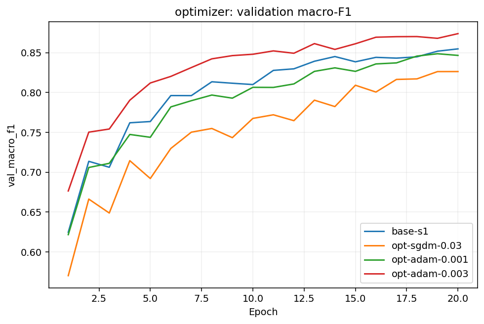
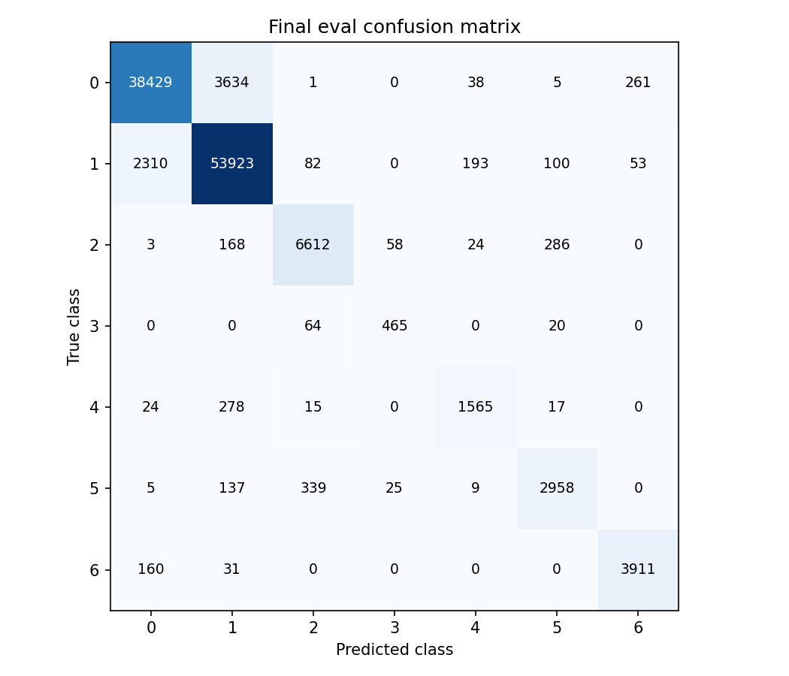

# Báo cáo Lab Day 1 — MSSV 2A202602853

## 1. Thiết lập

Forest CoverType, split metadata giữ nguyên: 464,809 train / 116,203 eval. Validation phân tầng 20%, seed 42: 371,847 train / 92,962 val. Chuẩn hóa 10 cột liên tục chỉ bằng train; 44 cột nhị phân giữ nguyên. PyTorch 2.8.0+cu128, cpu, 2 CPU threads. GPU memory không áp dụng trên CPU.

M-base tự định nghĩa: 54→256→128→7, 47,879 tham số. Baseline CE, SGD momentum=0.9, LR=0.1, batch=512, He, FP32, 20 epoch, không dropout/clip/weight decay. Adam dùng betas=(0.9,0.999), eps=1e-8, weight_decay=0. Tất cả so sánh kỹ thuật dùng cùng seed 1 và 20 epoch; train loss đo eval trên 50,000 mẫu cố định.

## 2. Kiểm tra ban đầu và độ nhiễu

`base-s1`: step0 CE=2.269062, khác ln(7)=1.945910 vì logit He ngẫu nhiên không đều; không sửa He để ép loss. Part 1: shape (B,7), 47,879 tham số; tất cả 6 tensor tham số có gradient khác 0; overfit 20 mẫu, 500 bước, loss=0.000000757, accuracy=100.00%. [Ảnh overfit](figures/part1_overfit20.png). Mốc majority validation=0.487597.

Baseline seeds 1/2/3: val accuracy=0.907457 ± 0.003517; macro-F1=0.854838 ± 0.002547; **2σ=0.005093**. Đây là mốc nhiễu tham khảo từ 3 seed, không phải kiểm định ý nghĩa thống kê và không đại diện mọi cấu hình. [Ảnh baseline](figures/compare_baseline_seeds.png).

## 3. Kết quả theo chủ đề

Dự đoán dưới đây được ghi vào `results/part3_plan.json` trước khi chạy. Mỗi run có JSON, dòng Excel và ảnh riêng. Metric tại checkpoint có val loss thấp nhất; so CE/MSE bằng F1, không so loss khác thang. Đối chiếu từ một seed chỉ mô tả hướng quan sát, chưa chứng minh cơ chế nhân quả.

### Hàm mất mát

- [`loss-mse`](figures/loss-mse.png): dự đoán **MSE on raw logits versus one-hot targets may fit classification less effectively than CE.** Thực đo: F1=0.7360664509053169, best epoch=19, diverged=False; ΔF1 so `base-s1`=-0.115918, vượt 2σ baseline. Đối chiếu: phù hợp hướng dự đoán (ΔF1 so `base-s1`=-0.115918, vượt 2σ baseline). MSE averages (logit-one_hot)^2 over B x 7 without 1/2; it is not MSE on softmax probabilities. CE gradient is p-y; logit MSE gradient is 2*(z-y)/7. Compare F1, not loss scales.

[Ảnh chồng loss](figures/compare_loss.png).

### Bộ tối ưu

- [`opt-sgdm-0.03`](figures/opt-sgdm-0.03.png): dự đoán **SGD momentum LR 0.03 may converge more slowly than 0.1.** Thực đo: F1=0.8264273145468909, best epoch=20, diverged=False; ΔF1 so `base-s1`=-0.025557, vượt 2σ baseline. Đối chiếu: phù hợp hướng dự đoán (ΔF1 so `base-s1`=-0.025557, vượt 2σ baseline). Momentum accumulates gradients; LR controls the size of each update.

- [`opt-adam-0.001`](figures/opt-adam-0.001.png): dự đoán **Adam may converge faster through per-parameter adaptive updates.** Thực đo: F1=0.8458527882996129, best epoch=18, diverged=False; ΔF1 so `base-s1`=-0.006132, vượt 2σ baseline. Đối chiếu: phù hợp hướng dự đoán (F1 epoch 3=0.711201 vs baseline=0.706247). Adam uses bias-corrected first/second moments; optimizer and its LR change together for fair tuning.

- [`opt-adam-0.003`](figures/opt-adam-0.003.png): dự đoán **Larger Adam LR may accelerate early fitting but increase oscillation.** Thực đo: F1=0.8740348173262795, best epoch=20, diverged=False; ΔF1 so `base-s1`=+0.022050, vượt 2σ baseline. Đối chiếu: phù hợp hướng dự đoán (F1 epoch 3=0.754287 vs baseline=0.706247). Compare each optimizer at its own best validation LR with the same 20-epoch budget.

[Ảnh chồng optimizer](figures/compare_optimizer.png).

So ở LR tốt nhất **trong các LR đã thử**, cùng budget 20 epoch:

| Optimizer | exp_id | LR | val F1 | best epoch |
|---|---|---:|---:|---:|
| sgd_momentum | base-s1 | 0.1 | 0.851984 | 19 |
| adam | opt-adam-0.003 | 0.003 | 0.874035 | 20 |

AdamW không được thử; với weight_decay=0, Adam và AdamW có cùng cập nhật. Khi decay>0, AdamW tách decay khỏi moments.

### Batch size

- [`batch-2048`](figures/batch-2048.png): dự đoán **Larger batch reduces updates per epoch and may slow convergence at fixed LR.** Thực đo: F1=0.8094982220859012, best epoch=20, diverged=False; ΔF1 so `base-s1`=-0.042486, vượt 2σ baseline. Đối chiếu: phù hợp hướng dự đoán (ΔF1 so `base-s1`=-0.042486, vượt 2σ baseline). Batch 2048 changes update count, not just memory: ceil(N/2048) vs ceil(N/512) per epoch.

[Ảnh chồng hparam](figures/compare_hparam.png).

371,847 mẫu: batch 512 có 727 updates/epoch; batch 2048 có 182. Thời gian epoch lần lượt 3.191s / 2.156s. Không thử scaling LR/warmup; chưa thể kết luận batch lớn kèm LR tối ưu.

### Dropout

- [`drop-0.1`](figures/drop-0.1.png): dự đoán **Dropout may reduce the train-val gap but hurt a baseline still improving at epoch 20.** Thực đo: F1=0.8417663954300617, best epoch=20, diverged=False; ΔF1 so `base-s1`=-0.010218, vượt 2σ baseline. Đối chiếu: phù hợp hướng dự đoán (ΔF1 so `base-s1`=-0.010218, vượt 2σ baseline). Dropout adds training noise and reduces co-adaptation; train loss is measured in eval mode.

[Ảnh chồng dropout](figures/compare_dropout.png).

Gap cuối baseline=0.024025, dropout=0.008703. Khoảng cách nhỏ và baseline còn cải thiện không chứng minh quá khớp; dropout chỉ nên dùng khi có evidence train giảm nhưng val tăng, không mặc định giúp.

### Gradient clipping

- [`clip-normal`](figures/clip-normal.png): dự đoán **Clipping should activate at normal LR and may slow learning.** Thực đo: F1=0.8277551614149751, best epoch=18, diverged=False; ΔF1 so `base-s1`=-0.024229, vượt 2σ baseline. Đối chiếu: phù hợp hướng dự đoán (ΔF1 so `base-s1`=-0.024229, vượt 2σ baseline). Global norm threshold is half the baseline epoch-mean norm; actual clipped-step fraction is recorded.

- [`clip-high-none`](figures/clip-high-none.png): dự đoán **Ten-fold LR may cause large gradients, unstable loss, or divergence.** Thực đo: F1=0.744103453992362, best epoch=20, diverged=False; ΔF1 so `base-s1`=-0.107881, vượt 2σ baseline. Đối chiếu: phù hợp hướng dự đoán (4 lần val loss tăng >5%; diverged=False). Stress-test reference changes LR; compare clipping only against this same high-LR run.

- [`clip-high-on`](figures/clip-high-on.png): dự đoán **At the same high LR clipping may limit spikes, but cannot guarantee stable convergence.** Thực đo: F1=0.8090982415774659, best epoch=19, diverged=False; ΔF1 so `base-s1`=-0.042886, vượt 2σ baseline. Đối chiếu: phù hợp hướng dự đoán (high-LR no-clip F1=0.744103453992362, clipped F1=0.8090982415774659). Compared with clip-high-none only clip_norm changes; norms are logged before clipping.

[Ảnh chồng clipping](figures/compare_clipping.png).

`clip-normal`: clip=0.287, 14538/14540 bước bị cắt (99.99%), diverged=False.

`clip-high-none`: clip=None, 0/14540 bước bị cắt (0.00%), diverged=False.

`clip-high-on`: clip=0.287, 1986/14540 bước bị cắt (13.66%), diverged=False.

Cặp LR=1.0 chỉ khác clip; clipping giới hạn norm gradient, không giới hạn trực tiếp bước momentum hoặc khôi phục neuron ReLU đã chết. Không mặc định gọi đó là “cứu được”.

### Mixed precision

- [`amp-bf16`](figures/amp-bf16.png): dự đoán **Mixed precision may not improve end-to-end speed on this small MLP; numerical trajectories may change.** Thực đo: F1=0.8500407518872137, best epoch=18, diverged=False; ΔF1 so `base-s1`=-0.001944, chưa vượt 2σ baseline. Đối chiếu: phù hợp hướng dự đoán (median time/epoch=65.670s vs FP32=3.155s). BF16 has an FP32-like exponent range; FP16 has narrower range and needs loss scaling. Parameters and evaluation remain FP32.

[Ảnh chồng amp](figures/compare_amp.png).

Wall-clock mean: FP32 3.191s/epoch; BF16 2232.532s/epoch. Median: FP32=3.155s, BF16=65.670s, ratio=0.048×; BF16 không nhanh hơn theo median quan sát. Epoch outlier >5×median=[8, 12]; mean có thể chứa quãng gián đoạn thực thi, không diễn giải thành chi phí tính toán. GPU memory=null trên CPU. FP16: unavailable: FP16 training requires CUDA; measured BF16 on CPU; BF16: CPU autocast measured. Không suy rộng CPU sang GPU hoặc coi median là benchmark kiểm soát nhiễu; timing gồm đánh giá FP32. FP16 exponent hẹp cần GradScaler; BF16 exponent 8 bit như FP32 thường không cần scaling.

### Khởi tạo

- [`init-zeros`](figures/init-zeros.png): dự đoán **Zero initialization leaves hidden ReLU gradients zero; only output bias can learn class priors.** Thực đo: F1=0.09364999018625456, best epoch=14, diverged=False; ΔF1 so `base-s1`=-0.758334, vượt 2σ baseline. Đối chiếu: phù hợp hướng dự đoán (ΔF1 so `base-s1`=-0.758334, vượt 2σ baseline). Identical zero neurons preserve symmetry and ReLU derivative at zero is zero.

- [`init-normal`](figures/init-normal.png): dự đoán **Small normal weights shrink activations and may delay convergence.** Thực đo: F1=0.8492641904306735, best epoch=20, diverged=False; ΔF1 so `base-s1`=-0.002720, chưa vượt 2σ baseline. Đối chiếu: phù hợp hướng dự đoán (ΔF1 so `base-s1`=-0.002720, chưa vượt 2σ baseline). Normal std=0.01 is independent of fan-in; repeated layers can attenuate signal.

- [`init-xavier`](figures/init-xavier.png): dự đoán **Xavier may shrink ReLU activations relative to He; a shallow MLP may still train well.** Thực đo: F1=0.8469795188443587, best epoch=18, diverged=False; ΔF1 so `base-s1`=-0.005005, chưa vượt 2σ baseline. Đối chiếu: phù hợp hướng dự đoán (std kích hoạt so với He trong bảng bên dưới). Xavier normal variance=2/(fan_in+fan_out); He variance=2/fan_in for ReLU.

[Ảnh chồng init](figures/compare_init.png).

| init | step0 loss | Std sau từng Linear, 512 mẫu val |
|---|---:|---|
| he | 2.269062 | 0.666205, 0.646387, 0.593344 |
| zeros | 1.945910 | 0.000000, 0.000000, 0.000000 |
| normal | 1.945996 | 0.034617, 0.003800, 0.000279 |
| xavier | 2.022177 | 0.278051, 0.220274, 0.196886 |

Mạng chỉ có hai lớp ẩn; khác biệt này không chứng minh hành vi mạng 30 lớp trong slide. Zero chỉ học bias lớp ra, không học đặc trưng ẩn.

## 4. Đánh giá cuối trên tập eval

Khóa lựa chọn **trước eval**: ứng viên `opt-adam-0.003` thắng theo val F1; giữ hyperparameters và tăng budget lên 40 epoch × 3 seed. Final val F1 mean±sample std=0.894095±0.004972; chọn một mô hình `final-s3` theo val F1, không ensemble. Cấu hình đầy đủ trong `results/final_selection.json`. [Ảnh final](figures/compare_final.png).

| Cấu hình | Seed | val F1 | eval F1 | eval acc |
|---|---:|---:|---:|---:|
| base-s1 | 1 | 0.851984 | 0.851434 | 0.901612 |
| final-s3 | 3 | 0.898530 | 0.896880 | 0.928229 |

Điểm do `scripts/evaluate.py` tạo: 116,203 row_id hợp lệ. Δeval F1=+0.045446; mốc 2σ val=0.005093, không có nhiều seed eval nên không gọi đây là kiểm định nhiễu eval. Final eval−val F1=-0.001651. Không chỉnh cấu hình sau eval.

### Phân tích lỗi theo lớp

| Lớp (0-based) | Support | Precision | Recall | F1 |
|---|---:|---:|---:|---:|
| 0 | 42368 | 0.938873 | 0.907029 | 0.922676 |
| 1 | 56661 | 0.926974 | 0.951678 | 0.939163 |
| 2 | 7151 | 0.929566 | 0.924626 | 0.927089 |
| 3 | 549 | 0.848540 | 0.846995 | 0.847767 |
| 4 | 1899 | 0.855659 | 0.824118 | 0.839592 |
| 5 | 3473 | 0.873597 | 0.851713 | 0.862516 |
| 6 | 4102 | 0.925680 | 0.953437 | 0.939354 |

Lớp khó nhất=4, F1=0.839592, support=1899; nhầm nhiều nhất sang lớp 1: 278 mẫu. [Ma trận nhầm lẫn](figures/confusion_eval.png), hàng=thật/cột=dự đoán. Dữ liệu mất cân bằng là cơ chế khả dĩ; sự giống nhau đặc trưng chỉ là giả thuyết, chưa phân tích feature để chứng minh. Có thể thử class-weighted CE và đánh giá trên val trong nghiên cứu tiếp theo.

## 5. Câu hỏi dẫn dắt

Các câu về optimizer, dropout, clipping, precision và initialization được trả lời ở mục 3. Khi loss không giảm sau 2,000 bước, ba kiểm tra đầu tiên: (1) loss bước 0 so ln(C), kiểm tra nhãn/scale/logits và softmax hai lần; (2) tắt regularization, overfit 20 mẫu để phân biệt lỗi pipeline với thiếu khả năng tổng quát; (3) sau backward kiểm tra gradient từng tham số, zero_grad, optimizer và mức LR để phát hiện graph bị ngắt hoặc neuron chết.

## 6. Hạn chế và điều bất ngờ

Một seed cho ablation, ba seed cho baseline/final; 2σ baseline chỉ là heuristic. LR search hữu hạn; so optimizer kèm LR là ngoại lệ có chủ đích. MSE chưa được tối ưu LR riêng; hồi quy logit không kiểm chứng saturation của MSE trên softmax. Batch khác làm số update khác. Final tăng epoch nên không quy toàn bộ cải thiện cho một kỹ thuật. CPU không chứng minh AMP GPU; timing có quãng gián đoạn. Không nghiên cứu calibration hoặc feature similarity. Step0 He cao hơn ln(7) là kết quả ngoài giả định logit gần đều, đã chẩn đoán ở Part 1.

## 7. Phụ lục

22 runs: `results/*.json`, `figures/<exp_id>.png` và ảnh chồng; `experiments.xlsx` giữ template/formulas/Seeds/Summary; `predictions_eval.csv`, `eval_result.json`, `REPORT.md`, `code/lab.ipynb` cùng toàn bộ mã trong `code/`. Không nộp dữ liệu gốc hoặc checkpoint. Tổng thời gian epoch đã đo=790.7 phút, chưa gồm plotting, nạp dữ liệu, Part 0–1 và rerun để lấy weights. Chạy lại: `python submission_2A202602853/code/run_part34.py` từ repo sau khi split_data.py.

Khi runtime/data/code khác bản đã khóa, notebook tự chuyển output sang `reproduction_<hash>` trước khi ghi kết quả. Có thể tự đặt `LAB_OUT_DIR` thành một đường dẫn tuyệt đối tới thư mục output mới; không dùng lại thư mục đã chấm eval để đổi cấu hình. Colab/Kaggle chưa được kiểm chứng trực tiếp trong lần chạy CPU này.
